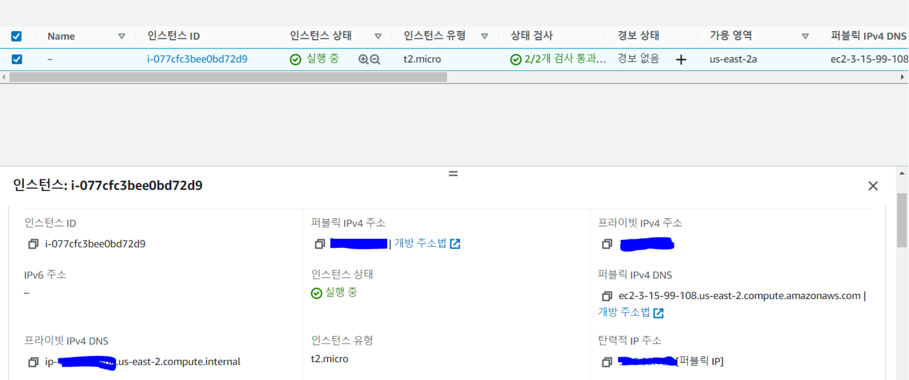
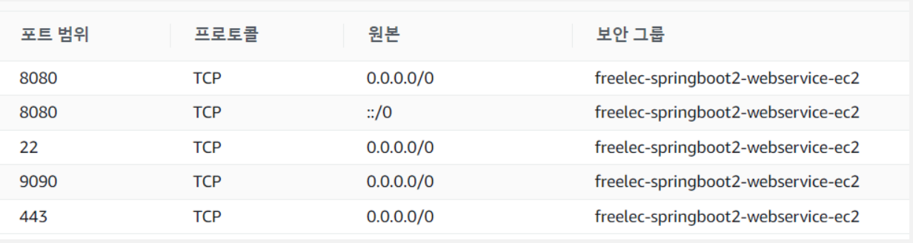
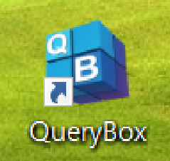
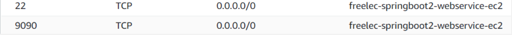
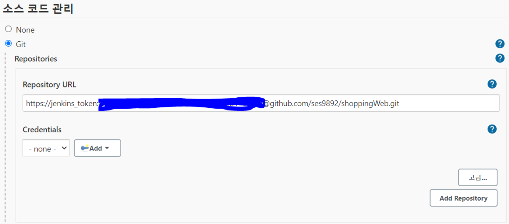
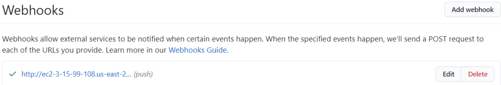
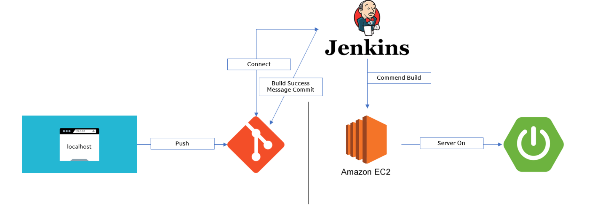
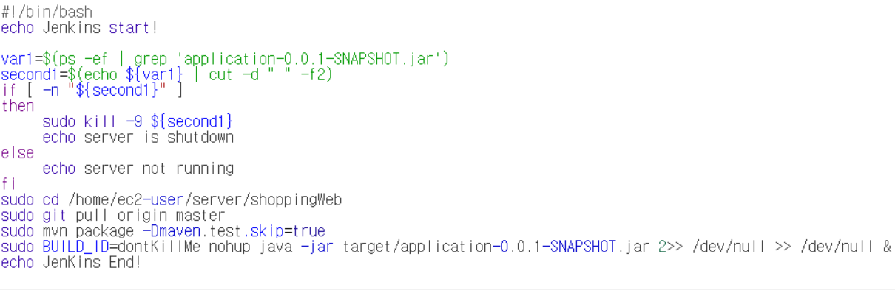

# shoppingWeb
 - #### 쇼핑몰에 필요한 REST FUL API를 구현
 - #### Linux 쉘 스크립트와 JenKins를 이용한 실시간 무중단 배포 

## Environment
- #### Frame Work : Spring Boot
- #### Server : AWS EC2
- #### DB : RDS (MYSQL)
- #### Tool : JenKins , Docker , Notion
##  📚 Rest API
- [Notion API 명세서 바로가기](https://spice-slope-94f.notion.site/0b13482e852d438e9767b880fceb937b?v=6869c75695fe4d62a8c1871692c1b9cd)

## 📚 AWS EC2
- ###AWS EC2
    
- ### API 서버를 위한 인바운드 포트 개방
    
## 📚 AWS RDS
- ### RDS (MYSQL)
    
- ### GUI Tool (Query Box)
    
## 📚 JenKins
- #### JenKins 서버포트 개방
  
- ####Git Token Repository
  
- #### Git & Jenkins WebHook Connect

- #### JenKins Logic + Shell Script 

    

